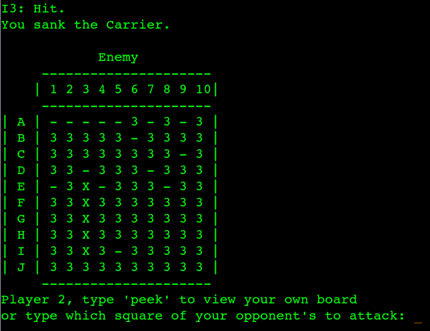

# battleship-php

Based on the popular board/pen-and-paper game, battleship-php is a 2-player implementation played via Command Line Interface.

<h2>Getting Started</h2>

To try out battleship-php, ensure you have PHP installed, clone this repo and run 'php Main.php' in the local repository. That's all there is to it.

<h2>Rules</h2>

The rules can be found <a href="https://en.wikipedia.org/wiki/Battleship_(game)#Description">here</a>.

<h2>Screenshot</h2>

